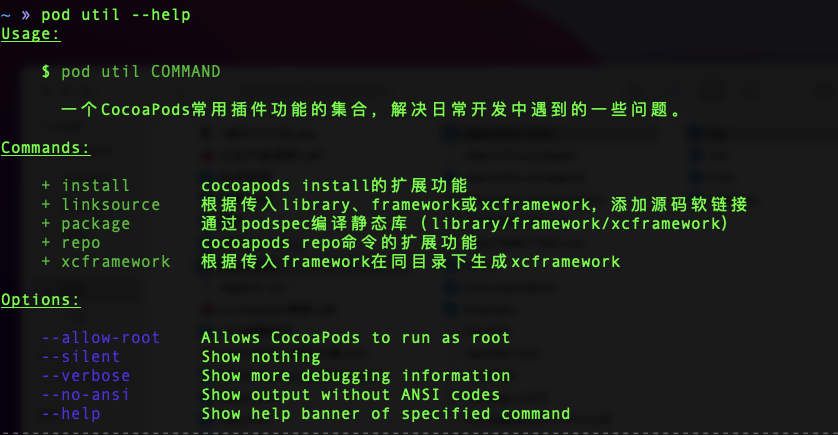
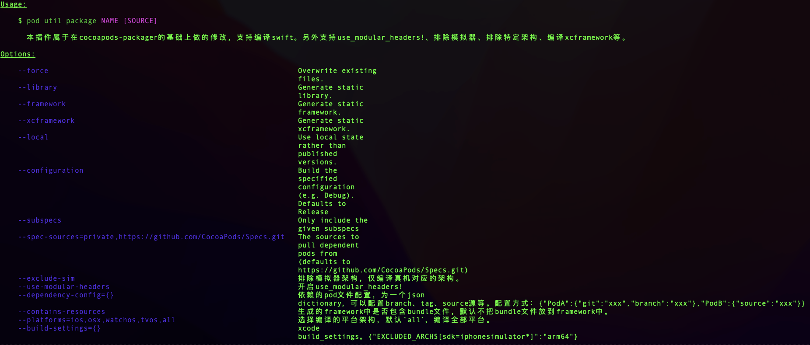
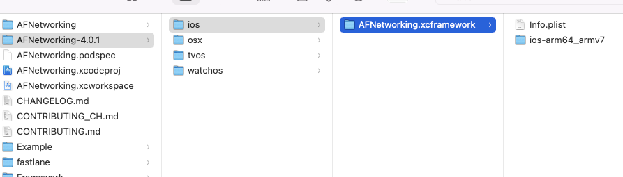
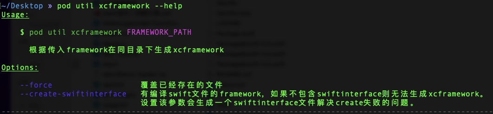
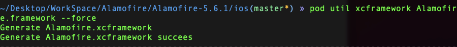
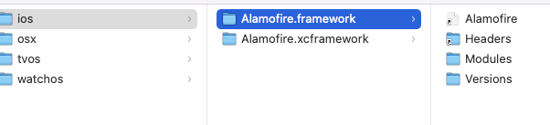
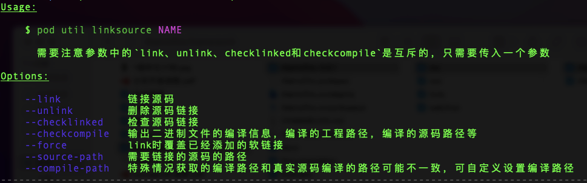
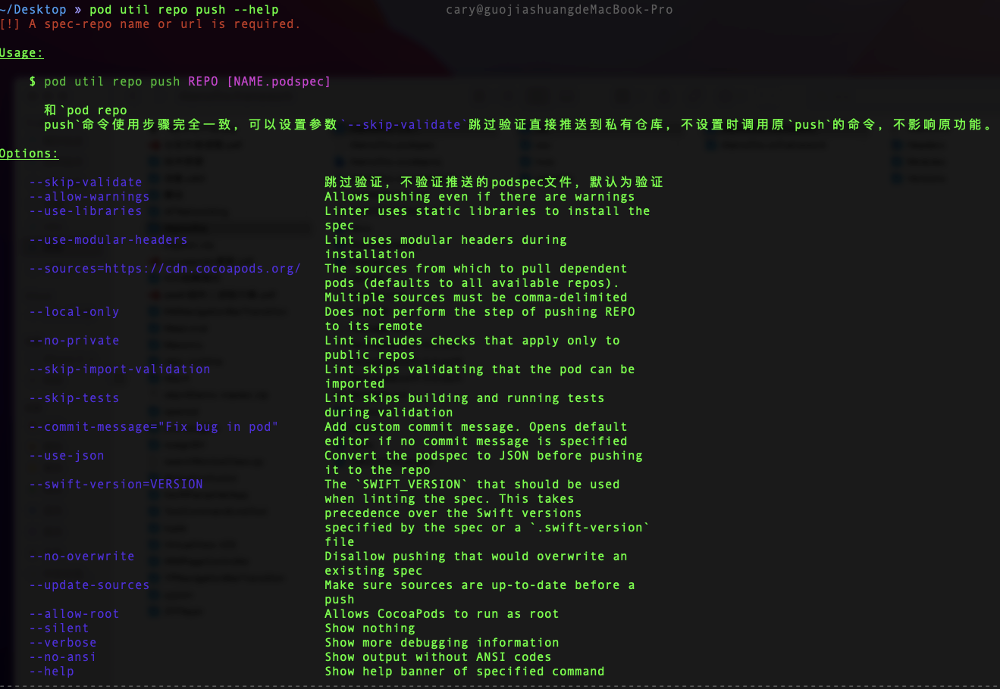
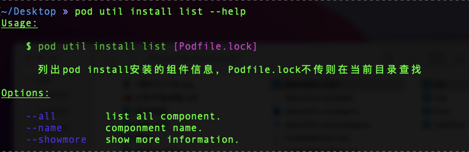
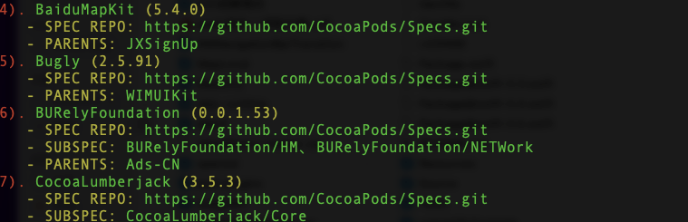

### **cocoapods-util是一个pod插件集合，集成了一些ios开发过程中提效的一些插件。**

# Installation

```
$ gem install cocoapods-util
```

# Usage

```
$ pod util --help
```



# 功能

## package

### 介绍

通过podspec文件生成library、framework、xcframework。

- [x] 支持swift
- [x] 支持自定义配置dependency
- [x] 支持排除模拟器
- [x] 支持多平台（ios、osx、watchos、tvos）
- [x] 支持自定义设置工程的build settings（如：排除ios模拟器64位架构、设置支持的架构等）

```
$ pod util package --help
```



### 示例

#### 生成xcfrmework/framework/library

生成AFNetworking组件的xcframework 进入AFNetworking源码的根目录下，执行下面的命令

```
$ pod util package AFNetworking.podspec --force --local --xcframework

$ pod util package AFNetworking.podspec --force --local --framework

$ pod util package AFNetworking.podspec --force --local --library
```



#### 排除模拟器

如果你不需要编译模拟器架构，可以添加--exclude-sim

```
$ pod util package AFNetworking.podspec --force --local --xcframework --exclude-sim
```

#### 平台设置

如果你只需要编译ios架构下的xcframework，可以添加--platforms=ios

```
$ pod util package AFNetworking.podspec --force --local --xcframework --exclude-sim --platforms=ios
```

#### build settings配置

如果你想要做一些build settings特殊配置，可以添加 --build-settings，如设置编译选项排除模拟器arm64架构。理论上来讲，可以像直接操作工程一样，灵活的配置build settings

- 如设置排除arm64位架构

```
$ --build-settings='{"EXCLUDED_ARCHS[sdk=iphonesimulator*]":"arm64"}'
```

- 设置编译swift生成swiftinterface文件

```
$ -build-settings='{"BUILD_LIBRARY_FOR_DISTRIBUTION":"YES"}'
```

- 或者你想设置多个编译选项

```
$ -build-settings='{"EXCLUDED_ARCHS[sdk=iphonesimulator*]":"arm64","BUILD_LIBRARY_FOR_DISTRIBUTION":"YES","VALID_ARCHS":"arm64"}'
```

#### 自定义dependencies

如果你依赖的组件并没有发布到私有仓库，你只是分支依赖！ 如果你依赖的组件和官方源有冲突，你改需要指定source源！ 这时候你可以通过配置`--dependency-config={}`选项指定仓库分支、tag或指定source源。

```
$ --dependency-config='{"PodA":{"git":"xxx","branch":"xxx"},"PodB":{"source":"xxx"}}'
```

## xcframework

### 介绍

可以把现有的framework生成xcframework。

- 内部可以判断是某个平台的framework（如ios、osx、watchos），直接在framework同级目录生成xcframework。



### 示例

生成Alamofire的framework

```
$ pod util xcframework Alamofire.framework --force 
```





## linksource

源码二进制链接功能。

```
$ pod util linksource --help
```



## repo push

推送私有pods仓库的命令。

- 可以通过添加--skip-validate的选项跳过验证步骤。

```
$ pod util repo push --help
```



该命令是一个提效命令，在推送自己私有仓库的时候可以通过设置--skip-validate选项跳过验证直接推送到私有仓库。

```
$ pod util repo push [yourSpecs] [xxx.podspec] --skip-validate
```

当然你也可以不使用--skip-validate，参数设置和`pod repo push`命令一致

## install list

列出安装的pod库及相关依赖信息。

- 该命令同样为提效命令，可以省去开发者自己去阅读Podfile.lock文件的时间，直接友好的提示开发者
- 可以清晰的看出引用的组件个数、组件依赖、组件分支tag信息、仓库地址等有效信息

```
$ pod util install list --help
```



可以在Podfile.lock的同级目录下执行或指定Podfile.lock的路径

```
$ pod util install list --showmore
$ pod util install list ~/Desktop/xxxx/ProjectA/Podfile.lock --showmore
```

